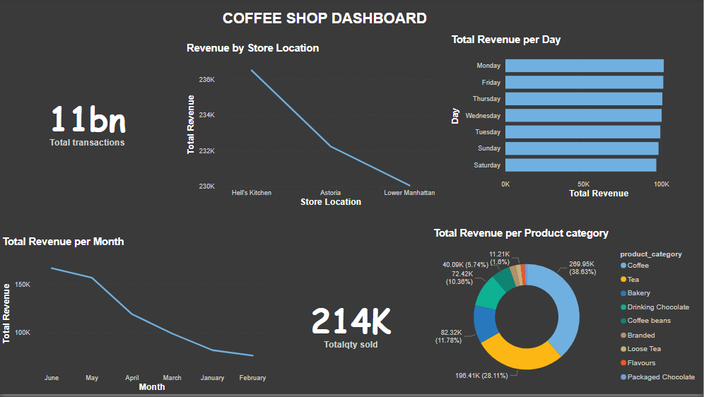

# Coffee-analysis

## Table of Content

- [Project Overview](Project-Overview)
- [Data source](Data-source)
- [Problem Statement](Problem-Statement)
- [Tools used](Tools-used)
- [Skills demonstrated](Skills-demonstrated)
- [Data Analysis](Data-Analysis)

- [Visualisations](Visualisations)
- [Results and Findings](Results-and-Findings)

- [Conclusion and Recommendations](Conclusion-and-Recommendations)
  
## Project Overview
## Data source
## Problem Statement
## Tools used
## Skills demonstrated
## Data Analysis

## Visualisations

1.	Sales Trends Over Time (Line Chart) – Shows daily or hourly sales patterns.
2.	Product Performance (Bar Chart) – Highlights the best-selling and least-selling products.
3.	Store Comparisons (Clustered Bar/Column Chart) – Compares sales across the three locations.
4.	Product Category Breakdown (Pie Chart) – Displays the proportion of sales by product category.
5.	Peak Sales Hours (Heatmap or Bar Chart) – Identifies the busiest hours of the day
   

## Results and Findings

## Conclusion and Recommendations
Based on the analysis, the following recommendations were proposed:
-	Optimize Inventory Management: Adjust stock levels based on product demand trends.
-	Improve Staffing Schedules: Allocate staff efficiently during peak sales hours.
- Targeted Promotions: Offer discounts on slow-moving products to increase sales.
- Enhance Product Offerings: Expand best-selling product lines while discontinuing low-performing items.
 visualizations:

### Back to top 
###### [Table of Content](#Table-of-Content)
